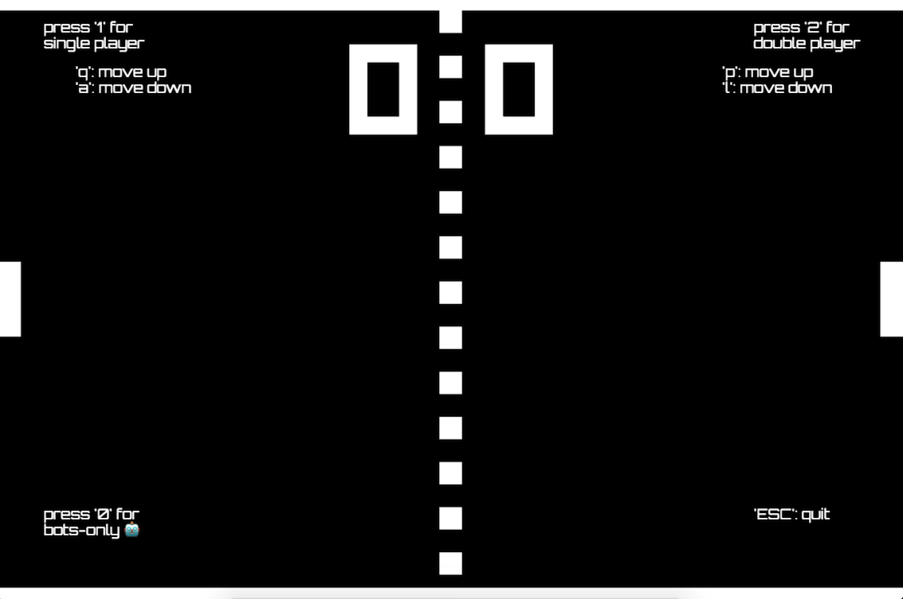

# Rust 🦀 WASM 🕸 Pong 🏓

A port of [codeincomplete's javascript pong](https://codeincomplete.com/games/pong/) written in rust and compiled to WebAssembly.



## Live Demo

[Play the live demo here!](https://pong.prawn.farm)

## Running locally

You need to have [cargo-web](https://github.com/koute/cargo-web) installed:

```sh
cargo install cargo-web
```

Then:

```sh
cargo web start --release
```

## Building static assets 

You must first install `wasm-opt`.  [See the instructions in the binaryen package for help](https://github.com/WebAssembly/binaryen#building).  `wasm-opt` needs to be visible in your path.

Then:

```sh
sh build.sh
```

Note that this will create a gzipped version of `rust-wasm-pong.wasm`. If you want to serve it locally, you'll need to present the file with the following headers, so that your browser can decode it.

```text
Content-Encoding: gzip
Content-Type: application/wasm
```

## Inspiration

- [zemeroth](https://ozkriff.itch.io/zemeroth)
- [good-web-game](https://github.com/not-fl3/good-web-game)
- [pyro](https://github.com/MaikKlein/pyro)
- [stdweb](https://github.com/koute/stdweb)
- [wasm and rust](https://github.com/raphamorim/wasm-and-rust)
